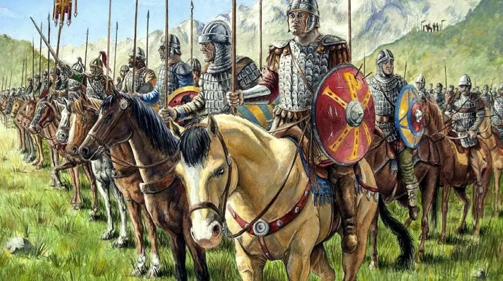

**Hispania Visigoda**

La Hispania visigoda es la denominación del período histórico que abarca el asentamiento del pueblo visigodo en la península ibérica, entre mediados del siglo V y comienzos del siglo VIII. Sociedad de la Hispania Visigoda

**Sociedad de la Hispania Visigoda**

E. A. Thompson afirma en su obra fundamental Los godos en Hispania (1969) que «la única fuente continua de información sobre los reinados de los reyes de la península ibérica desde Gesaleico a Liuva I (507-568) es la Historia de los reyes de los godos, vándalos y suevos de San Isidoro de Sevilla».

**Aspectos demográficos**

En cualquier caso, los godos debieron formar una minoría que se supone que empezaría a estar integrada en la sociedad hispanorromana. Su número no ha sido precisado con exactitud por historiador alguno, pero los cálculos más fiables hablan de entre 150 000 y 200 000 visigodos instalados en la península, sobre una población que no llegaba a los nueve millones, según San Isidoro de Sevilla. Otras fuentes hablan de 85 000-100 000 visigodos sobre una población de seis millones de hispanorromanos.1​
Recientemente se ha realizado un estudio arqueológico del poblamiento visigodo estimando una cifra para la población visigoda entre 130 000 y 150 000 personas, lo que representaría entre el 3 % y el 4 % de la población total hispana.7​
Los visigodos se asentaron sobre todo por la zona de la Meseta Norte, especialmente en el centro de la cuenca del río Duero, zona poco poblada y con escasa urbanización.
Este es el tiempo en el que se produce la reutilización de los materiales de construcción romanos para basílicas, iglesias y otras construcciones civiles (véase Arte visigodo).

[Arquitectura](Arquitectura.md)
[Obras](Obras.md)

